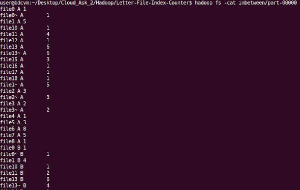
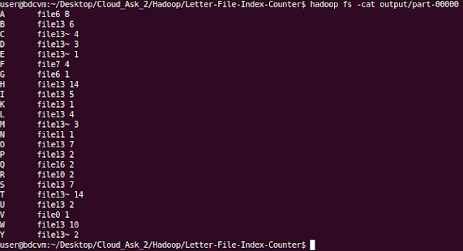

# Hadoop-Letter-File-Index-Counter
A Hadoop-based Java project that counts the max number of word occurences for each letter in a textfile of a folder.

## Project Description
We basically need for every letter of the alphabet to retrieve the maximum number of words beginning with this given letter, along with the file that these words are located. So in fact we have a case of a **wordcount** problem with a distributed file system twist.

To make this work based in the _MapReduce_ model, we need **2 rounds** of execution. 

### 1st execution round
#### Map (`Map_A` Class)
We initially ap the text we have as input into key-value pairs as follows, by scanning each file and picking out the first character of every word, and adding _1_ as the initial value since a given letter is found at least once in this given file by a particular compute node.

_`((letter, filename), 1)`_

#### Reduce (`Reduce_A` Class)
Then, we try to reduce the values we had from the pairs based by key, so for each individual letter and file we have the sum of occurences for words that start with that very letter, having this kind of key-value pairs as result:

_`((letter,filename), sum_of_occurences)`_

#### Inbetween results example

### 2nd execution round 
#### Map  (`Map_B` Class)
We map our inbetween results from the first round in a way so the key is each letter of the alphabet and the value is a composite one that refers to the filename with the maximum sum of occurences of words starting with that letter in particular.

_`(letter, (filename, sum_of_occurences))`_

#### Reduce (`Reduce_B` Class)
At last, we can simply reduce based by key once again, only this time instead of computing the sum we find and set the _max_ of all the sums of occurences and the filename of them.

_`(letter, (filename, max_num_of_occurences))`_

#### Final results example

In order to make those pairs work within the Hadoop environment, we need to create specific classes (`FilenameSumCompositeKey`, `LetterFilenameCompositeKey`) to make objects and hold the data for the composite keys and values during the execution rounds.

## Execution Guide
_(while being in the project directory)_

* Create the input directory in the HDFS
`hadoop fs -mkdir input`

* Copy all the files from the local _input_ directory to the HDFS _input_ directory
`hadoop fs -put ./input input`

* Create a directory to store the .class files
`mkdir HLFIC_classes`

* Compile the project
`javac -classpath "$(yarn classpath)" -d HLFIC_classes LetterFileIndexCounter.java LetterFilenameCompositeKey.java FilenameSumCompositeKey.java`

* Create the jar file of the project
`jar -cvf HLFIC.jar -C HLFIC_classes/ .`

* Run the project 
`hadoop jar HLFIC.jar org.myorg.LetterFileIndexCounter input inbetween output`

* Print the results to the terminal
`hadoop fs -cat output/part-00000`

## Project Info
* All the input files are located in the `input` directory with 20 files that contain a small phrase from  by Franz Kafka.
* All the files of inbetween results will appear to the distributed file system under the `inbetween` directory
* All the files of the final results will appear to the distributed file system under the `output` directory
* Number of reducers can be changed for both execution rounds
* Sister project with the 
